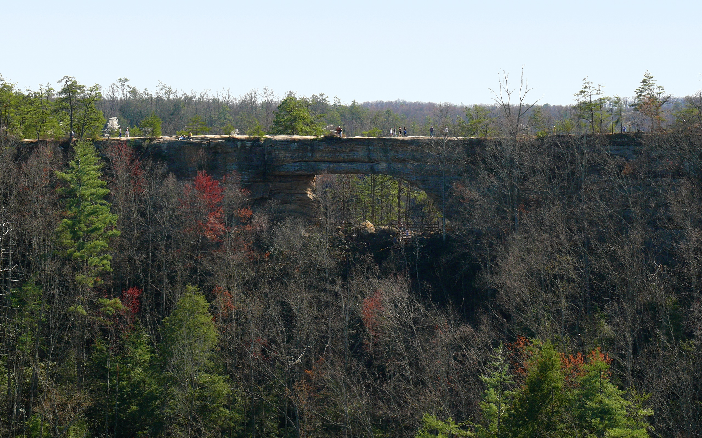
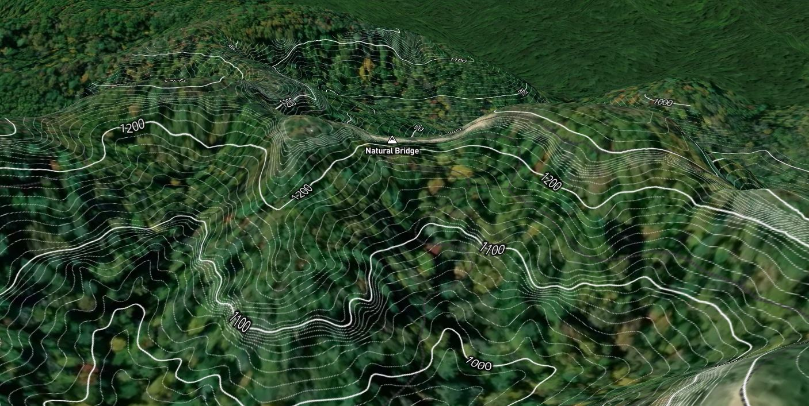
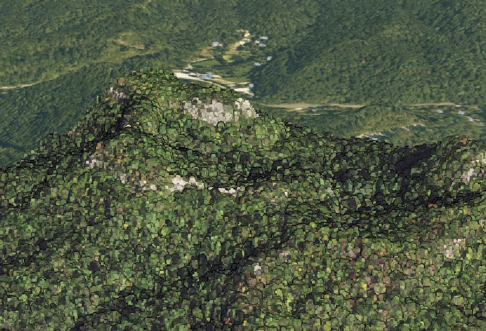
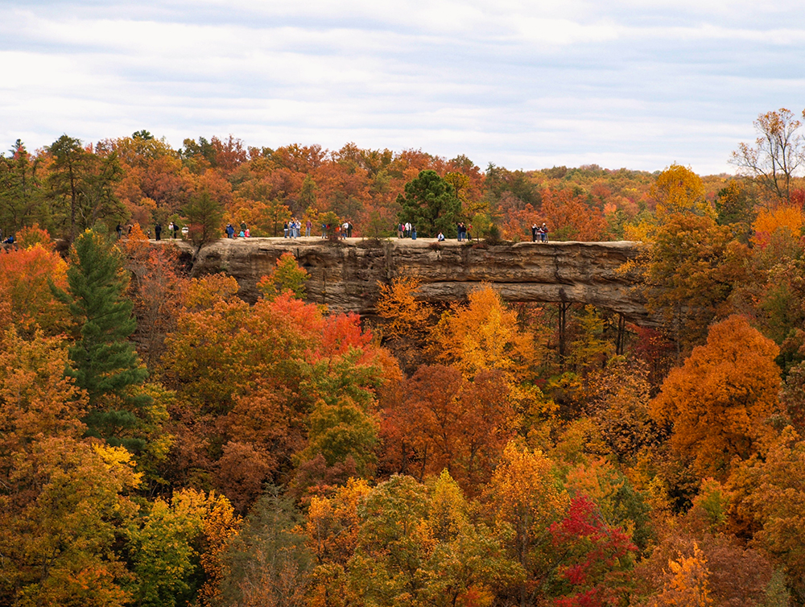

# Natural Bridge

###### Source: https://upload.wikimedia.org/wikipedia/commons/thumb/d/db/Natural_Bridge_KY-27527-3.jpg/426px-Natural_Bridge_KY-27527-3.jpg

# Introduction

Natural Bridge is located in Slade, Ky and is about an hour east of Lexington, KY. It is a naturally forming arch that is made out of sandstone. It's a tourist hot spot for many kentuckians. I have been to the hiking trails at Natural Bridge a few times and I always enjoy the views!

# Mapping The Bridge
## Map of Natural Bridge with contour intervals

###### link to interactive map: https://api.mapbox.com/styles/v1/tjmapper99/ckorxu5f8060a19nod7jeczaj.html?fresh=true&title=view&access_token=pk.eyJ1IjoidGptYXBwZXI5OSIsImEiOiJja29yOWF1bmwwamVuMnBwZGM1M2ZxZTB3In0.DjPaPH8Gvx3CTjZSApO-uQ

#
## Screenshot of a slide from tour showing Cesium Point Cloud

###### link to tour: https://cesium.com/ion/stories/viewer/?id=665d3e21-bc2c-4c48-99db-4e7f5e88b8f4

# 
## Natural Bridge in the fall

###### Source: https://www.google.com/url?sa=i&url=https%3A%2F%2Fwww.kentuckyliving.com%2Fexplore%2Ffall-peaks-and-peeks&psig=AOvVaw1y1tIyNIlnOcOh3FzG6kqU&ust=1621315204422000&source=images&cd=vfe&ved=0CAIQjRxqFwoTCKC6vv_7z_ACFQAAAAAdAAAAABAY

# Goals of the project
my goal for this project was to learn more and see natural bridge in a new way. I have been there a few times but being able to map it in a few different ways was a good experience.
#
This project was created by Timothy Stuart for a final project in GEO 409 taken at the University of Kentucky during the spring of 2021.
#
While making this project I used Mapbox, Cesium ion, and ArcGISpro. Some data was from KyFromAbove project.
